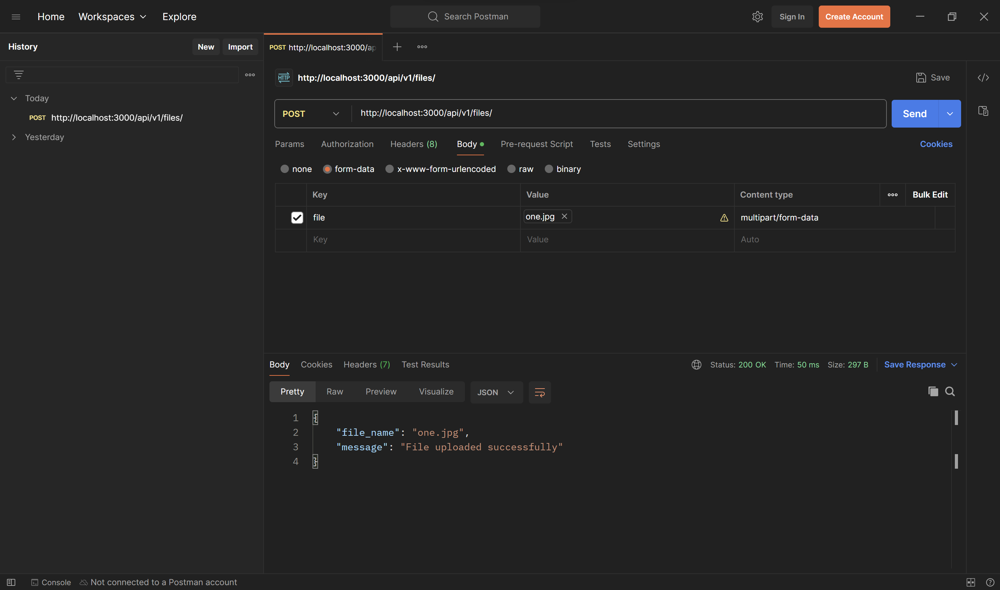
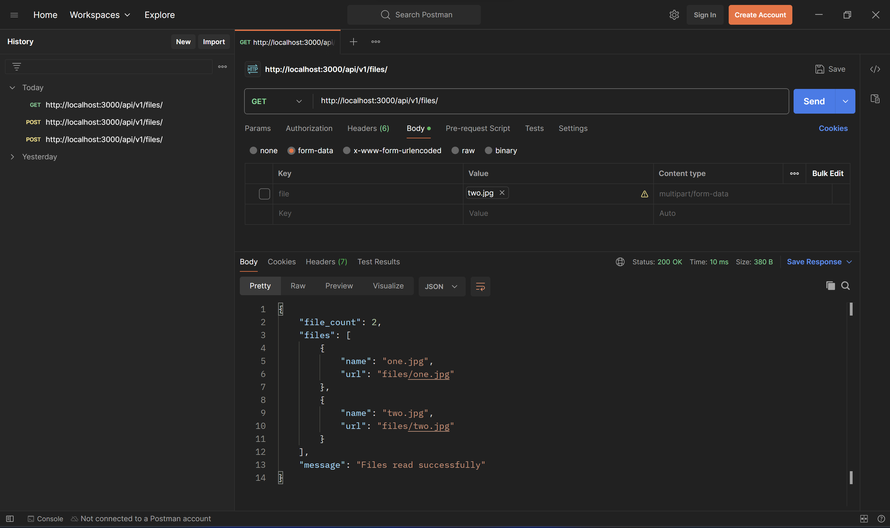
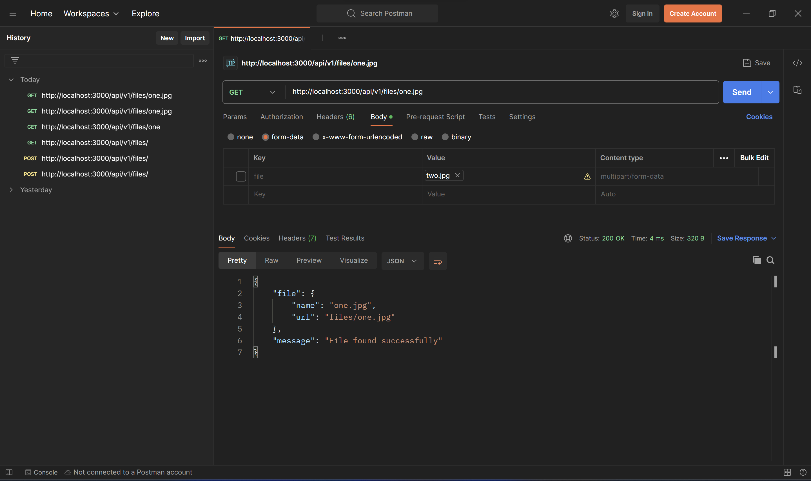
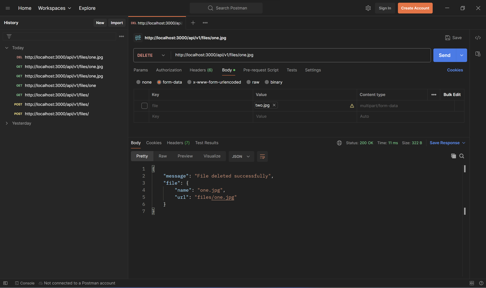

# File Management API

### Created a simple file management API using ExpressJS and Multer that stores the uploaded files in 'file' folder at the root.

### We can perform CRUD operations with the files.

#### There are two endpoints RESTful:

`/api/v1/files` and `/api/v1/:filename`.

To get list of all files make a `GET` request on `/api/v1/files`.

To get details of one file make a `GET` request on `/api/v1/files/:filename`.

To add a new file make a `POST` request on `/api/v1/files` and attach file in 'file' key in the form data.

To delete an existing file make a `DELETE` request on `/api/v1/files/:filename`.

### Attaching screenshots for reference

